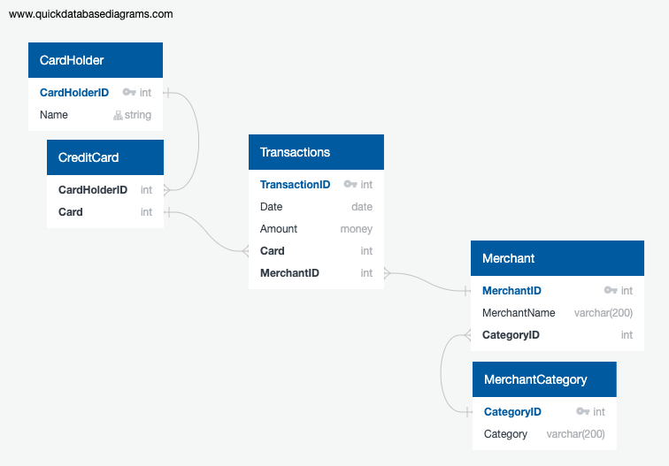

# sql-homework
## Looking for Suspicious Transactions
In this data analysis a database of csv data has been created. The schema and seed files were used to pull and create the tables of data in postgresql. Given the following connections in the created entity-relationship diagrma (ERD):

This data was then queried to view specific timeframes of data, look for abnormal charges in early morning hours and to look for micro hacking charges that are abnormally low and occur frequently unnoticed by most cardholders.

Additionally, a visual analysis is provided for card holders 2 and 18 on their transactions over the year. A separate analysis was used for assessing the monthly transactions for card holder 25 from January to June.

